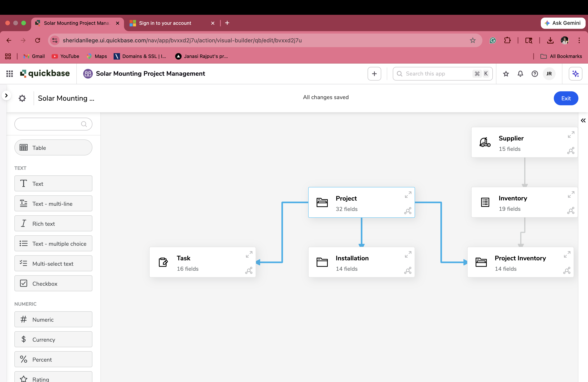
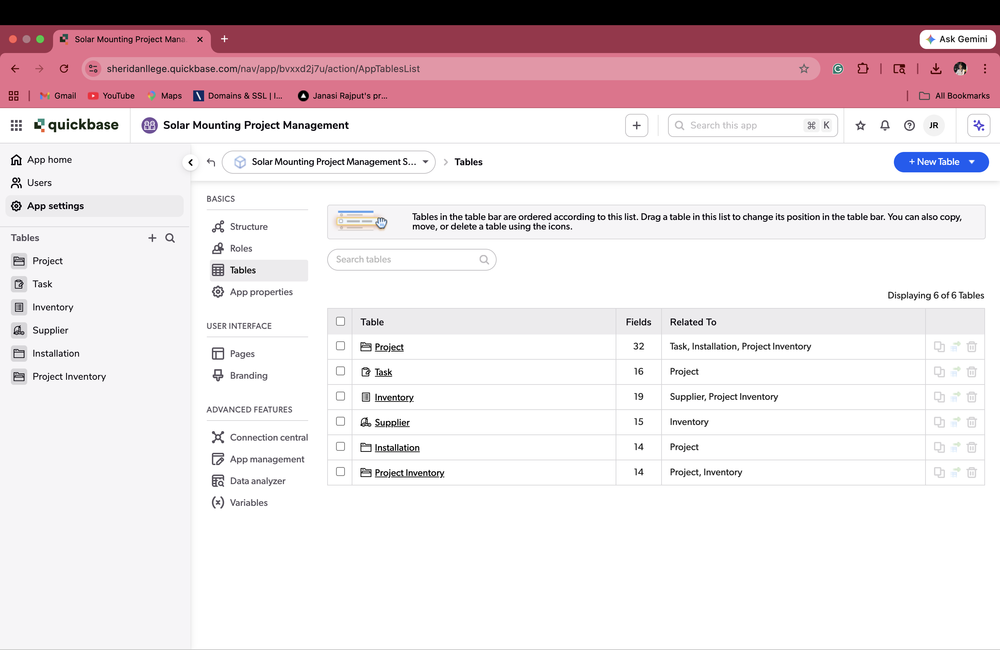
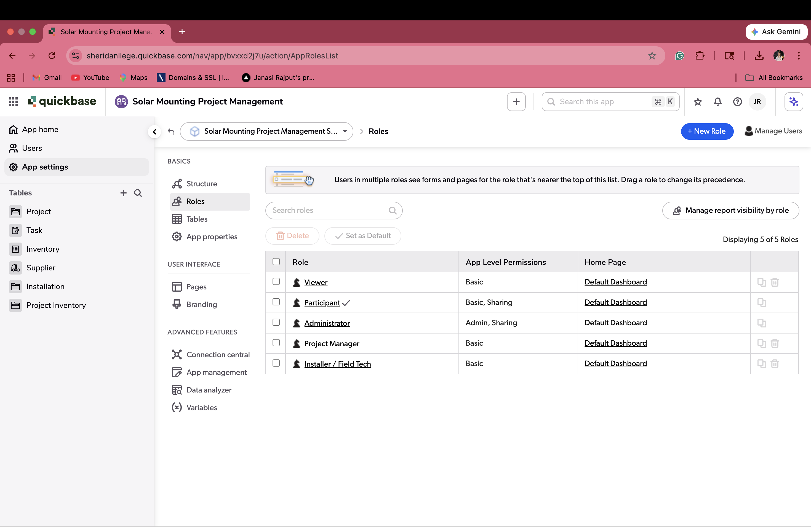
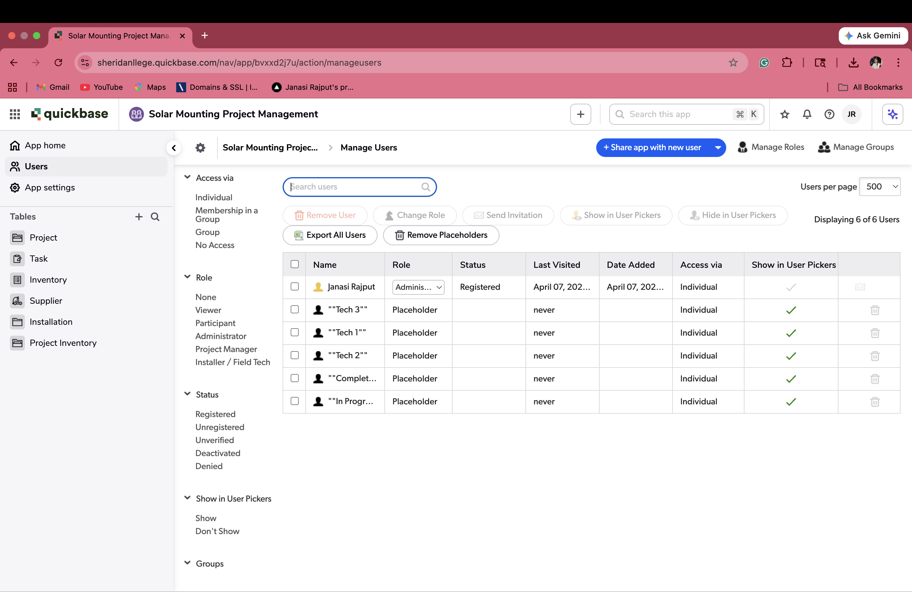
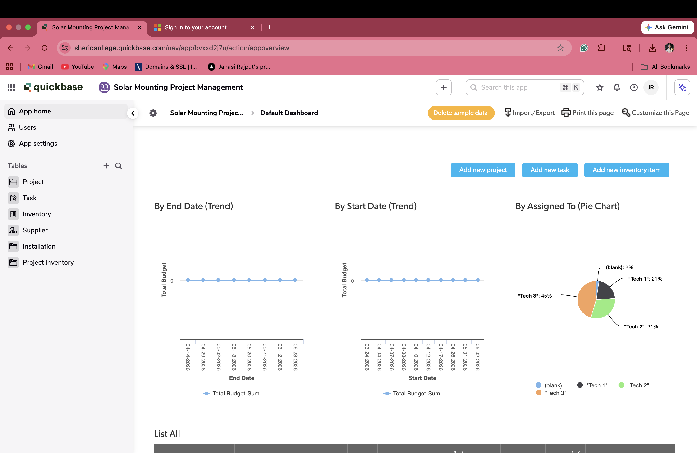
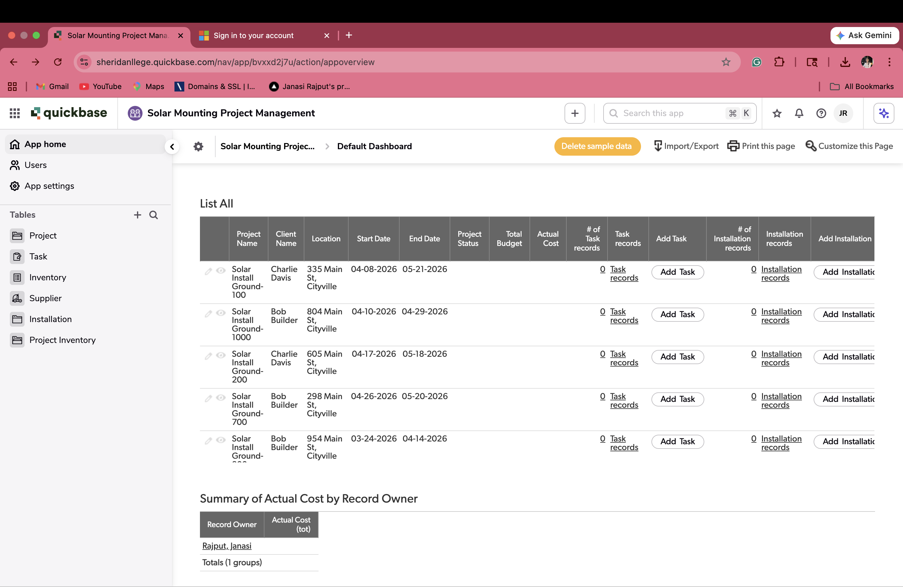

# Solar Mounting Project Management System
Developed a Quickbase project within 6 hours to demonstrate proficiency in low-code application development, including database design, workflows, and dashboard creation.

**A robust, low-code relational database and operational dashboard built in Quickbase to manage end-to-end solar racking projects, inventory, hardware suppliers, and field installations.**

[](https://www.quickbase.com/)
[](https://www.python.org/)

## 📝 Overview
This application serves as the operational backbone for a solar racking enterprise (e.g., KB Racking). It digitizes paper workflows by logically connecting hardware inventory levels, supplier logistics, and active field construction projects. 

Instead of disparate spreadsheets, this application enforces strict relational logic, alerting stakeholders when inventory crosses critical thresholds and automatically notifying managers upon project completion.

---

## 🏗️ System Architecture & Entity Relationships
The application is built on a structured relational schema consisting of five interconnected tables:

*   **Suppliers**: Master index of hardware partners (Fabricators, Extrusion Partners, Distributors).
*   **Inventory**: Aggregates all parts (L-Feet, Rails, Mid-Clamps) tied via `[Supplier ID]`. Contains critical threshold logic for re-ordering.
*   **Projects**: Top-level parent tracking locations, statuses, expected timelines, and assigned managers.
*   **Tasks**: Child of Projects. Granular tracking of site assessments, permitting, racking assembly, and electrical grounding.
*   **Installations**: Field execution logs tied to Projects.
*   *Project Inventory (Junction Table)*: Manages many-to-many relationship mapping exact inventory quantities depleted for specific Projects.

 *(Note: struct screenshot here)*
 *(Note: tables screenshot here)*

---

## ⚡ Smart Automations & Event Triggers
Quickbase native automations were implemented to reduce manual administrative overhead:

1.  **Low Inventory Webhook / Warning**: 
    If `Quantity on Hand` < `Critical Threshold` (e.g., `< 50` Rails), an email notification and platform alert to the Project Manager is fired to trigger procurement routines.
2.  **Project Completion Hand-off**:
    Listens for `<Project Status>` transitioning to `Completed`. Triggers a pipeline notification to dispatch invoicing and client-handover procedures.

---

## 🔐 Role-Based Access Control (RBAC)
To maintain data integrity while allowing field technicians to interact with the system, strict permissions were configured at the application level:

| Role | Scope | Permissions |
| :--- | :--- | :--- |
| **Administrator** | Global | Full App access, schema modification, Role management. |
| **Project Manager** | Strategic | View/Modify/Add/Delete access across Projects, Tasks, and Installations. |
| **Installer / Field Tech** | Execution | **View-Only** for Projects/Tasks. **Modify** access limited to assigned Installations for updating field statuses. |

 *(Note: roles screenshot here)*
 *(Note: users screenshot here)*

---

## 📊 Dashboards & Operational Analytics
The front-end user experience revolves around dynamic, live-updating dashboards tailored to business KPIs:

-   **Active Projects Pipeline**: List reports categorized by stage (Permitting, Engineering, Construction).
-   **Inventory Depletion Velocity**: Real-time flagged reports showcasing what parts require immediate re-order.
-   **Resource Allocation**: Pie charting and graphical trendlines tracking open tasks assigned per field technician.

 *(Note: Quickbase Dashboard screenshot here)*
 *(Note: Quickbase Dashboard screenshot here)*

---

## 💻 Data Engineering (Mocking the Data)
Because this is a bespoke implementation, I wrote a Python script to populate the cloud schema with highly realistic testing data to prove out the relationships and dashboard calculations.

*Check the `gen_solar_csv.py` file for the Python script and resulting CSV drops utilized in the initial migration.*

```python
# Snippet of the data generation script used to mock the Inventory
inventory_items = ["L-foot Bracket", "Aluminum Rail 10ft", "Mid Clamp", "End Clamp", "Grounding Lug"]
for item in inventory_items:
    inventory.append({
        "Item Name": item,
        "Quantity on Hand": random.randint(20, 200),
        "Critical Threshold": 50
    })
```
